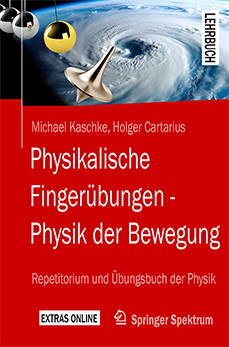
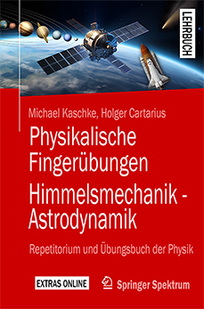

# SN Code Inside

Dieses GitHub-Repository ergänzt die Bücher

[Fingerübungen der Physik: Mechanik. Ein Repetitorium und Übungsbuch mit MATLAB-Programmen](https://link.springer.com/book/10.1007/978-3-662-69331-5) von Michael Kaschke und Holger Cartarius (Springer Spektrum 2025)

und

[Fingerübungen der Physik: Himmelsmechanik - Astrodynamik. Ein Repetitorium und Übungsbuch mit MATLAB-Programmen](https://link.springer.com/book/9783662693322) von Michael Kaschke und Holger Cartarius (Springer Spektrum 2025)

Es enthält Rohdaten und Matlab-Skripte zu den einzelnen Kapiteln.

Weitere [Zusatzmaterialien](https://www.fingeruebungen-physik.de/) zu den Fingerübungen der Physik finden sich unter [https://www.fingeruebungen-physik.de/](https://www.fingeruebungen-physik.de/). 

## Band I - Mechanik

[Physik der Bewegung von Körpern](https://github.com/sn-code-inside/fingeruebungen-physik/tree/main/bew)

[Physik des Kontinuums](https://github.com/sn-code-inside/fingeruebungen-physik/tree/main/kontmech)

## Band II - Himmelsmechanik - Astrodynamik

[Himmelsmechanik](https://github.com/sn-code-inside/fingeruebungen-physik/tree/main/hm)

[Astrodynamik](https://github.com/sn-code-inside/fingeruebungen-physik/tree/main/adyn)

