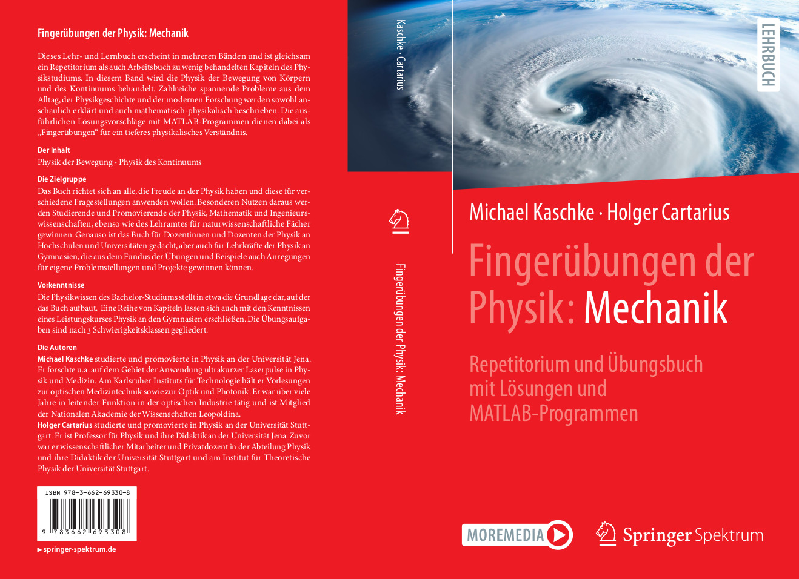
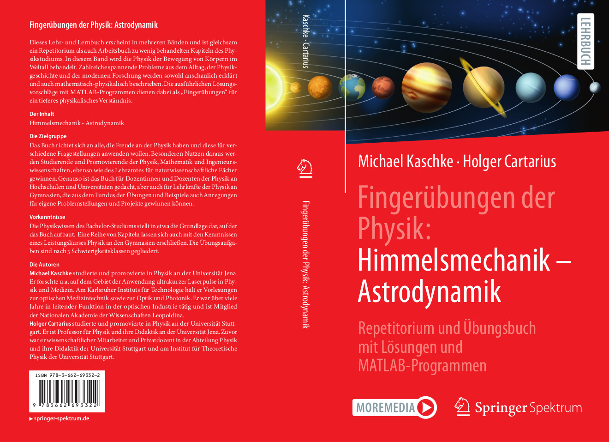

# SN Code Inside

Dieses GitHub-Repository ergänzt das Buch [Physikalische Fingerübungen: Astronomie. Ein Repetitorium und Übungsbuch mit MATLAB-Programmen](https://link.springer.com/) von Michael Kaschke (Springer Spektrum 2024)

Es entält Rohdaten und Matlab-Skripte zu den einzelnen Kapiteln.

Weitere [Zusatzmaterialien](https://www.physikalische-fingeruebungen.de/) zu den Physikalische Fingerübungen finde sich unter dem [Link](https://www.physikalische-fingeruebungen.de/). 

## Band I - Physik der Bewegung

[Physik der Bewegung](https://github.com/sn-code-inside/physikalische-fingeruebungen)

## Band II - Himmelsmechanik und Astrodynamik

[Himmelsmechanik](https://github.com/sn-code-inside/physikalische-fingeruebungen)

[Astrodynamik](https://github.com/sn-code-inside/physikalische-fingeruebungen)

